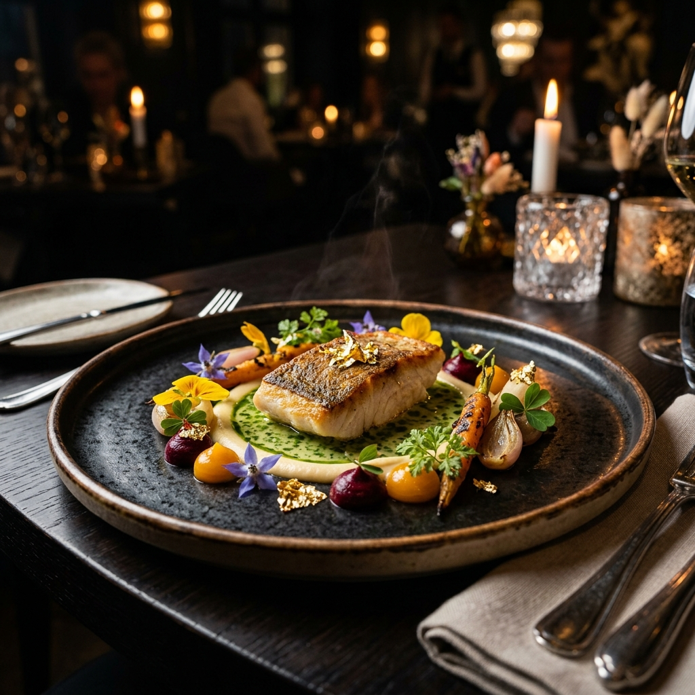

# 🍽️ L'Essence - Premium Restaurant Experience

A high-end, minimalist restaurant website template built with **Next.js 16**, **TypeScript**, and **Framer Motion**. Designed for a luxury portfolio with a focus on "Quiet Luxury" aesthetics, smooth animations, and a seamless user experience.


## ✨ Features

- **Luxury Hero Section**: Stunning visuals with parallax effects and elegant typography reveals.
- **Interactive Seasonal Menu**: Smooth-tabbed interface for browsing Appetizers, Main Courses, and Desserts.
- **Chef's Story**: A minimalist storytelling section featuring professional food photography.
- **Glassmorphism Reservation System**: A sleek, modern booking form integrated with the site's dark aesthetic.
- **Responsive Design**: Fully optimized for mobile, tablet, and desktop viewing.


## 🛠️ Tech Stack

- **Framework**: Next.js 16 (App Router)
- **Language**: TypeScript
- **Styling**: Vanilla CSS (CSS Modules)
- **Animations**: Framer Motion
- **Icons**: Lucide React
- **Assets**: Custom-generated AI imagery

## 🚀 Getting Started

First, install the dependencies:

```bash
npm install
```

Then, run the development server:

```bash
npm run dev
```

Open [http://localhost:3000](http://localhost:3000) with your browser to see the result.

## 📸 Signature Dishes



---

Developed with ❤️ as a portfolio project.
