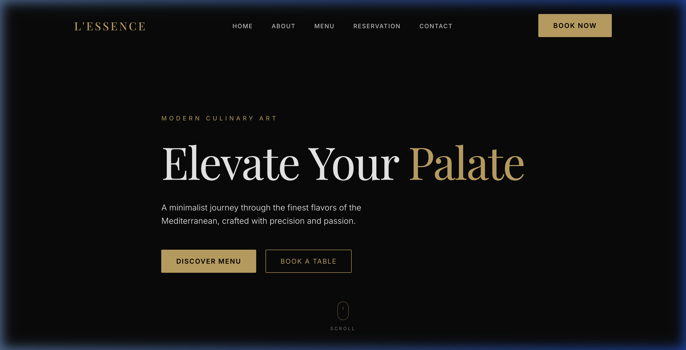
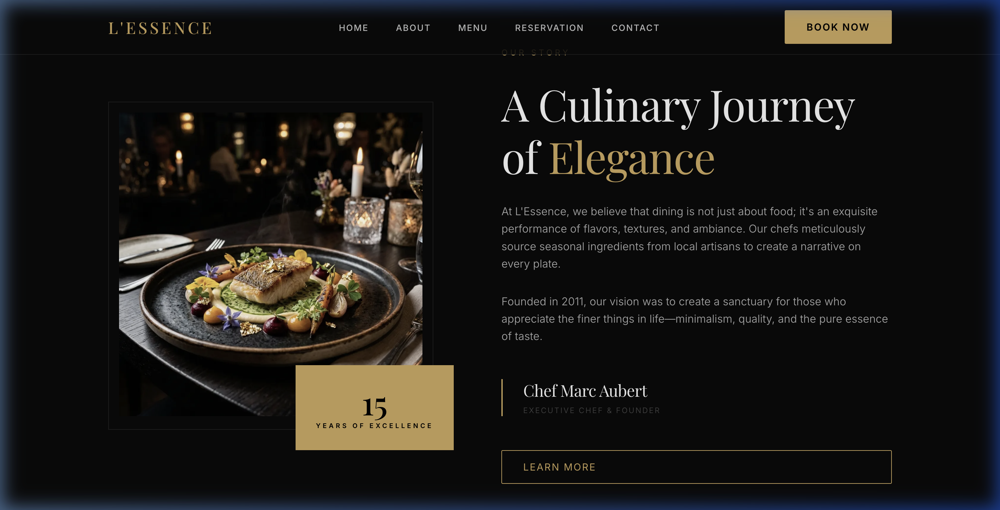
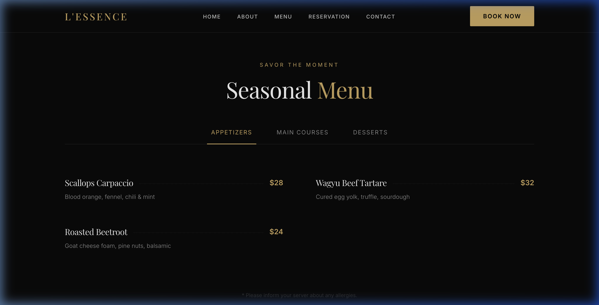
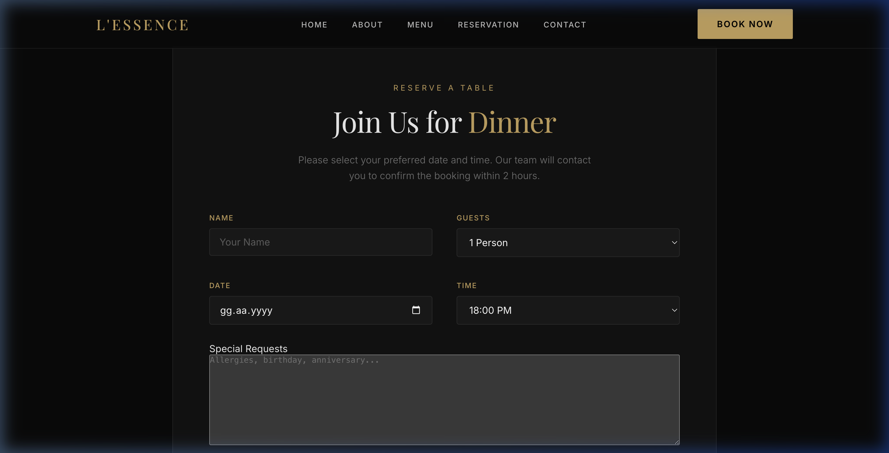
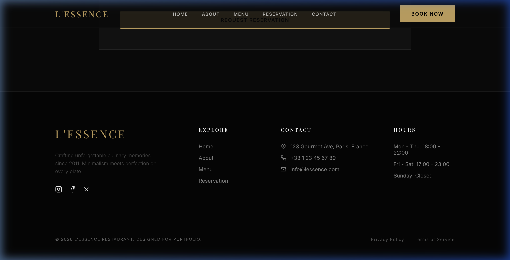

# 🍽️ L'Essence - Premium Restaurant Experience

A high-end, minimalist restaurant website template built with **Next.js 16**, **TypeScript**, and **Framer Motion**. Designed for a luxury portfolio with a focus on "Quiet Luxury" aesthetics, smooth animations, and a seamless user experience.

---

## 📸 Section Gallery

### 1. Luxury Hero Section
Experience the "Elevate Your Palate" landing with a cinematic dark-mode interior and elegant typography.



### 2. Our Story (About)
A minimalist storytelling section centered around culinary excellence and artisanal heritage.



### 3. Seasonal Menu
A smooth-tabbed interactive menu showcasing Appetizers, Main Courses, and Desserts.



### 4. Precision Reservation
A glassmorphism-styled booking system for a seamless guest experience.



### 5. Signature Branding (Footer)
A modern, dark-themed footer with all your contact and location details.



---

## 🛠️ Tech Stack

- **Framework**: Next.js 16 (App Router)
- **Language**: TypeScript
- **Styling**: Vanilla CSS (CSS Modules)
- **Animations**: Framer Motion
- **Icons**: Lucide React
- **Assets**: Custom-generated AI imagery

## 🚀 Getting Started

First, install the dependencies:

```bash
npm install
```

Then, run the development server:

```bash
npm run dev
```

Open [http://localhost:3000](http://localhost:3000) with your browser to see the result.

---
Developed with ❤️ as a portfolio project.
